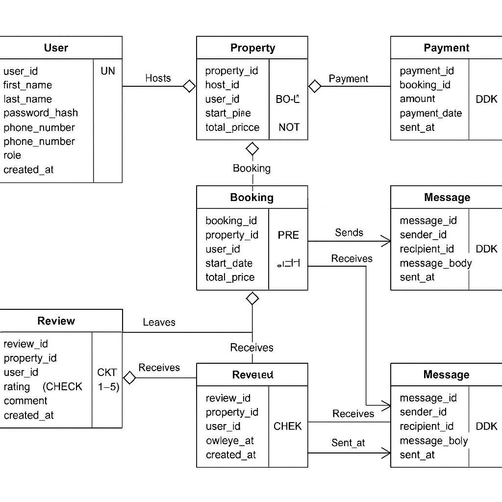

# Entity-Relationship Diagram Specification for Airbnb Database

## Objective
Create a comprehensive Entity-Relationship (ER) diagram for the Airbnb-style platform, representing all entities, their attributes, and the relationships between them.

---

## 1. Entities and Attributes

### 🧑‍💼 User
- **user_id** (PK, UUID, Indexed)
- first_name (VARCHAR, NOT NULL)
- last_name (VARCHAR, NOT NULL)
- email (VARCHAR, UNIQUE, NOT NULL)
- password_hash (VARCHAR, NOT NULL)
- phone_number (VARCHAR, NULL)
- role (ENUM: guest, host, admin, NOT NULL)
- created_at (TIMESTAMP, DEFAULT CURRENT_TIMESTAMP)

### 🏡 Property
- **property_id** (PK, UUID, Indexed)
- host_id (FK → User.user_id)
- name (VARCHAR, NOT NULL)
- description (TEXT, NOT NULL)
- location (VARCHAR, NOT NULL)
- price_per_night (DECIMAL, NOT NULL)
- created_at (TIMESTAMP, DEFAULT CURRENT_TIMESTAMP)
- updated_at (TIMESTAMP, ON UPDATE CURRENT_TIMESTAMP)

### 📅 Booking
- **booking_id** (PK, UUID, Indexed)
- property_id (FK → Property.property_id)
- user_id (FK → User.user_id)
- start_date (DATE, NOT NULL)
- end_date (DATE, NOT NULL)
- total_price (DECIMAL, NOT NULL)
- status (ENUM: pending, confirmed, canceled, NOT NULL)
- created_at (TIMESTAMP, DEFAULT CURRENT_TIMESTAMP)

### 💳 Payment
- **payment_id** (PK, UUID, Indexed)
- booking_id (FK → Booking.booking_id)
- amount (DECIMAL, NOT NULL)
- payment_date (TIMESTAMP, DEFAULT CURRENT_TIMESTAMP)
- payment_method (ENUM: credit_card, paypal, stripe, NOT NULL)

### ⭐ Review
- **review_id** (PK, UUID, Indexed)
- property_id (FK → Property.property_id)
- user_id (FK → User.user_id)
- rating (INTEGER, CHECK rating BETWEEN 1 AND 5, NOT NULL)
- comment (TEXT, NOT NULL)
- created_at (TIMESTAMP, DEFAULT CURRENT_TIMESTAMP)

### 💬 Message
- **message_id** (PK, UUID, Indexed)
- sender_id (FK → User.user_id)
- recipient_id (FK → User.user_id)
- message_body (TEXT, NOT NULL)
- sent_at (TIMESTAMP, DEFAULT CURRENT_TIMESTAMP)

---

## 2. Relationships

- **User - Property**: One-to-Many (a host can have multiple properties)
- **User - Booking**: One-to-Many (a user can make multiple bookings)
- **Property - Booking**: One-to-Many (a property can be booked many times)
- **Booking - Payment**: One-to-One (each booking has one payment)
- **User - Review**: One-to-Many (a user can leave many reviews)
- **Property - Review**: One-to-Many (a property can have many reviews)
- **User - Message**: Many-to-Many (via sender and recipient roles)

---

## 3. ER Diagram

---

## File Structure

alx-airbnb-database/
└── ERD/
├── requirements.md
└── ERD_diagram.png (or .pdf)
